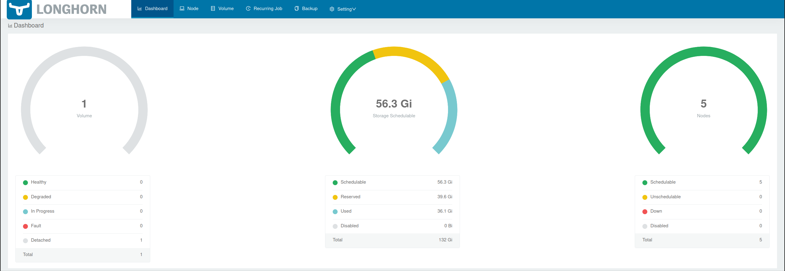
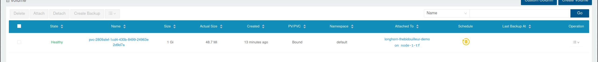

Je suis en plein apprentissage de Kubernetes et des solutions pour gérer un cluster, je pratique sur un cluster de test sur lequel se trouve des petits conteneurs comme celui gérant *thebidouilleur.xyz*.

Longhorn est un incontournable dans l'univers Kubernetes *(et notamment **k3s**)*, je ne pouvais pas continuer à apprendre sans m'attarder sur Longhorn.
Mais avant tout..

## Qu'est ce que Longhorn ?

Longhorn se présente sous cette simple phrase :
> Longhorn is a lightweight, reliable and easy-to-use distributed block storage system for Kubernetes.

Mais on peut aller un peu plus loin que cette simple phrase...
Longhorn est système de centralisation de stockage entre les noeuds du cluster. Cela veut dire qu'au lieu d'utiliser un stockage externe comme un NFS *([ou autre, voici la liste des possibilités](https://kubernetes.io/docs/concepts/storage/storage-classes/)* on va pouvoir utiliser garder les données en internes en utiliser les disques de nos machines présentes dans le cluster.

Et si vous vous posez la même question que moi avant de connaitre : Longhorn va faire l'équivalent d'un RAID 0 en réplicant les données sur plusieurs noeuds pour éviter que la perte d'une machine entraine la perte de donnée.

### Valeurs concrètes

Par exemple, en comptant les disques de mes noeuds j'ai 4x32Gio et 1x16Gio, soit 144Gio *( ou 132Go parce que Rancher utilise cette valeur )*.
Sur ces 132Go, j'en occupe 36 actuellement, je peux en utiliser 56 sur Longhorn, et j'en ai 40 réservés aux réplicas. *(par défaut, Rancher génère 3 replicas)*



## Comment déployer Longhorn ?

[*lien de la documentation officielle*](https://longhorn.io/docs/1.3.0/deploy/install/)

On peut déployer Longhorn via Helm, le catalogue Rancher ou juste via Kubectl *(l'option que j'ai choisi)*

  kubectl apply -f <https://raw.githubusercontent.com/longhorn/longhorn/v1.3.0/deploy/longhorn.yaml>

:::note Version !
Attention, cette commande va uniquement déployer la version **1.3.0** de longhorn, pensez à récupérer le dernier lien dans la documentation *(ou éditer le lien que j'ai mis)*

Par mesure de sécurité, il faut toujours vérifier ce que contient le yaml appliqué. Pensez à jeter un coup d'oeil !
:::

Il faudra attendre que les pods se déploient pour commencer à utiliser Longhorn.
Pour vérifier l'état en temps réel, la documentation vous propose la commande suivante:

```bash
kubectl get pods \
--namespace longhorn-system \
--watch
```

Mais vous pouvez aussi bien utiliser **[k9s](https://k9scli.io/)**.

Une fois OK, nous pourrons déployer notre premier pod lié à longhorn.

## Mise en pratique Longhorn

Voici le manifest que l'on va déployer pour utiliser un volume dans longhorn:

```yaml
apiVersion: v1
kind: PersistentVolumeClaim
metadata:
  name: longhorn-nginx-thebidouilleur-demo
spec:
  accessModes:
    - ReadWriteOnce
  storageClassName: longhorn
  resources:
    requests:
      storage: 1Gi
---
apiVersion: v1
kind: Pod
metadata:
  name: longhorn-thebidouilleur-demo
  namespace: default
spec:
  containers:
    - name: block-volume-test
      image: nginx:stable-alpine
      imagePullPolicy: IfNotPresent
      volumeMounts:
        - name: volume-longhorn
          mountPath: "/usr/share/nginx/html"
      ports:
        - containerPort: 80
  volumes:
    - name: volume-longhorn
      persistentVolumeClaim:
        claimName: longhorn-nginx-thebidouilleur-demo 
```



On demande bien 1Gio à allouer à ce volume *(ça influera sur le stockage alloué pour les replicas)* et on déploie un nginx classique.
Une fois déployé, on va ouvrir un tunnel vers ce pod:

```bash
kubectl port-forward longhorn-thebidouilleur-demo 8080:80
```

:::tip
 En sachant que le tunnel doit s'ouvrir sur votre poste **local** *(et non sur un des noeuds du cluster)*.
 Je vous invite à consulter [cette page](/docs/Kubernetes/kube-client) pour mettre kubectl sur votre machine.
:::

et si on interroge le nginx, on tombe évidemment sur une erreur 403 puisque le dossier longhorn est vide.
On va donc créer notre fichier *index.html* directement depuis le pod.

```bash
kubectl exec longhorn-thebidouilleur-demo -i -t -- /bin/sh
echo "Hello World" > /usr/share/nginx/html/index.html
```

Et en réinterrogeant notre pod : on tombe bien sur notre *Hello World*

```bash
[thebidouilleur@bertha ~]$ curl localhost:8080
Hello World
```

Maintenant.. c'est bien mignon mais est-ce que nous gardons bien notre page en cas de suppression du pod ?

```bash
kubectl delete pod longhorn-thebidouilleur-demo
```

On voit bien que sur le dashboard longhorn : le volume est passé en deattach. *(ce qui veut dire que les données sont toujours présentes mais pas utilisées sur un pod)*

On va ré-appliquer le même manifest pour recréer notre pod et refaire le même tunnel pour accéder au nginx

```bash
[thebidouilleur@bertha ~]$ curl localhost:8080
Hello World
```

Nous retrouvons bel et bien notre page "Hello World"!

## Conclusion

Longhorn est un outil extremement simple d'utilisation et permettant d'éviter de créer une solution externe au cluster qui serait moins pratique à gérer. Je ne suis pas non-plus aller très loin dans ses fonctionnalitées et je vous laisse vous faire votre propre avis pour *longhorn en production* (et pour ça, allez voir l'article du site [*easyadmin.tech*](https://easyadmin.tech/longhorn-solution-volumes-kubernetes-production))
Longhorn est le bienvenue dans mon Homelab de test et sera au centre de celui-ci !
