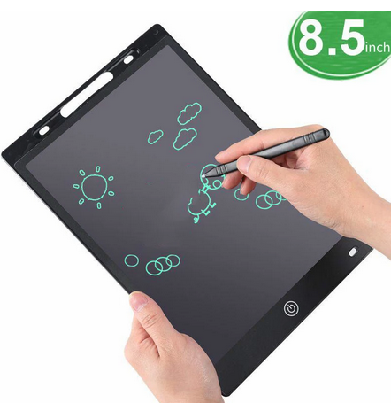
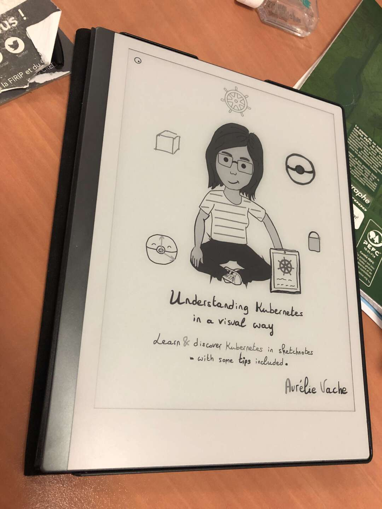
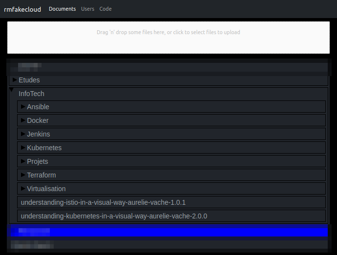
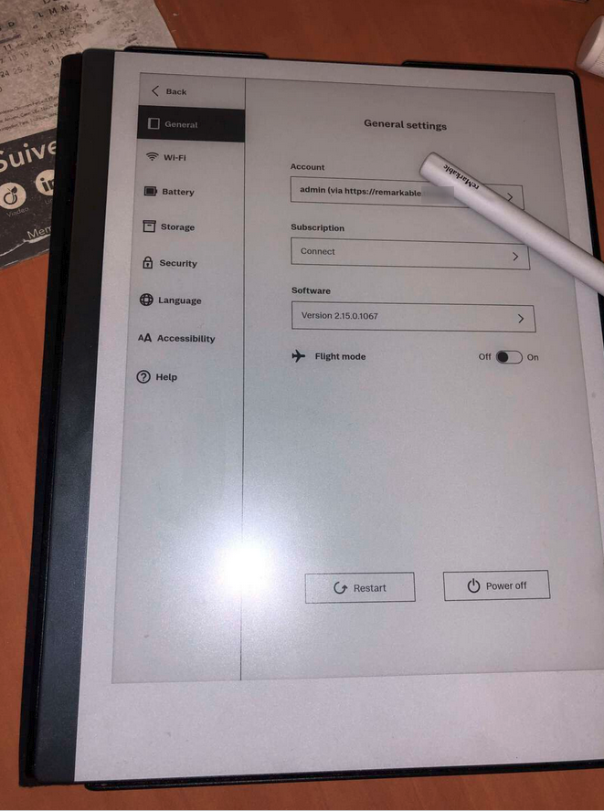
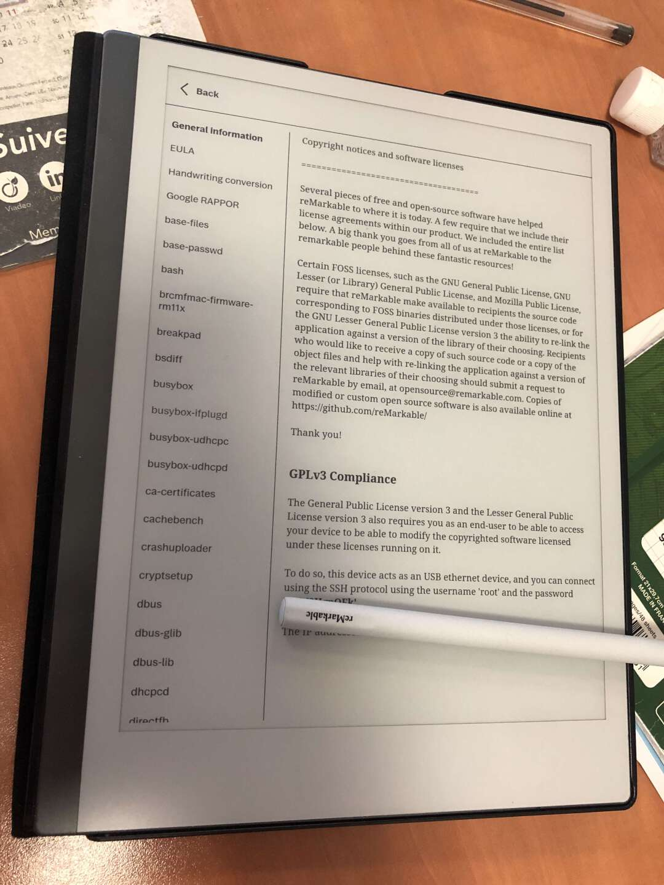

## Introduction

Récemment, j'ai suivi une formation de ~8 mois durant laquelle je n'avais qu'un clavier pour prendre des notes. Pour moi : aucun problème, je ne demande que ça : un support que j'utilise personnellement et professionnellement. 
Je tape plutôt vite *(environ ~100 mots/minutes)*, j'utilise des macros, et des raccourcis pour me simplifier la vie et si jamais j'ai besoin d'un schéma : je prend mon temps sur [draw.io](https://draw.io).

Mais durant des travaux d'équipes, j'ai compris l'importance *(et la puissance)* d'un crayon et d'une feuille de papier.
Sans méthode de représentation comme des schémas : on se perd vite.

---

J'ai donc acheté [*The Tablette*](https://fr.aliexpress.com/item/1005002840252915.html). Un jouet pour enfant fonctionnant comme n'importe quel tableau-magique que l'on avait en étant enfant. 

Et ce jouet de 5€ m'a sauvé la vie plusieurs fois durant les projets à plusieurs. C'était suffisant pour éviter l'achat de papier durant ces 8 mois. 

Je garde toujours cette tablette sur mon bureau, mais j'aimerai bien un système similaire mais gardant en mémoire mes écrits/dessins. 

C'est ainsi que j'ai acheté...

## La Remarkable

Ayant un collègue avec ce même bijou, j'ai pu me renseigner à l'avance *(et même tester)* cette *liseuse*. C'est une tablette basée sous Linux permettant de lire des PDF, et de prendre des notes via un stylet en imitant le plus possible la sensation du papier. 

La prise en main demande un peu d’entraînement mais après quelques heures on peut se rendre compte de la puissance du jouet entre ses mains.

On peut mettre des pdf de son ordinateur vers la tablette via USB ou directement en déposant les fichiers sur le cloud Remarkable. 

:::info autres méthodes 
Je crois qu’il également possible de déposer ses fichiers en wifi directement … jamais testé
:::

Mais si vous utilisez une tablette remarkable, n’oubliez pas que celle-ci va constamment se synchroniser avec les serveurs AWS de la marque en embarquant vos PDF.

C’est tout de même fâcheux … Si seulement on avait une solution ! 

### Remarkable Fake Cloud 

Dans son fonctionnement, la remarkable est un **Linux** avec un daemon systemd (nommé xochtl) qui va gérer l’écran e-ink. Et une fois le mot de passe root obtenu dans les paramètres *(après avoir lu que remarkable adore l’open-source, d’ailleurs c’est agréable qu’ils aient laissés le plein-pouvoir sur la tablette)* on peut s’amuser à faire pleins de choses…

La tablette peut donc acquérir de nouvelles fonctionnalités et également héberger quelques petites applications *(dans la limite du raisonnable)*. 
Et moi ce qui m’a intéressé là-dedans : c’est la possibilité d’avoir son propre cloud remarkable pour que ses fichiers restent à la maison !

Si ça en intéressent certains, voici le [lien du GitHub avec le lien vers la documentation](https://github.com/ddvk/rmfakecloud).

L'UI me permet d'uploader des PDF qui sont synchronisés dès que la tablette est sur le WiFi. Et je peux même envoyer des fichiers depuis mon propre smtp (chose impossible nativement).

:::info Pour trouver, il faut chercher
P'tite parenthèse sur l'auteur (DDVK) du projet. 
Il publie régulièrement des programmes pour rendre sa tablette + performante, + ergonomique mais il est très peu actif sur les forums / reddit, je vous invite à lui laisser une étoile pour être informé de ses nouveaux projets.
:::

Je peux donc fanfaronner en voyant mon utilisateur être *admin* sur la tablette.. :) 

## Conclusion

On a commencé à aborder la prise de note de manière différente à la sortie des iPads qui proposaient une expérience entre le PC et le smartphone. Remarkable a créé un produit incroyable en proposant une remise à plat de cette fonctionnalité : pas de clavier, pas de souris.. juste un stylet et un écran *"papier"*. 
Et comme la tablette est sous Linux, je suis sûr que nous n'avons pas fini d'exploiter son potentiel en la bidouillant.  (Je n'ai pas précisé, mais nous avons un accès root sur la RM2) 

Hate de voir une remarkable dans un cluster Kubernetes ! 

:::caution Sécurité
(Edit le 24/10) 
Attention à ne rien stocker de confidentiel, la tablette n'est pas chiffrée ! Bien que les accès ne soient pas évident (Il faudrait démonter et dump la carte eMMC), il est possible de retrouver vos fichiers assez facilement. 
Si le sujet vous interesse, voici un article qui en parle et porpose même une solution : https://blog.redteam-pentesting.de/2021/remarkable-encryption/
:::

:::note
*(Attention, j'ai pas parlé du prix.. restez accroché si vous voulez vous l'acheter)*
:::

