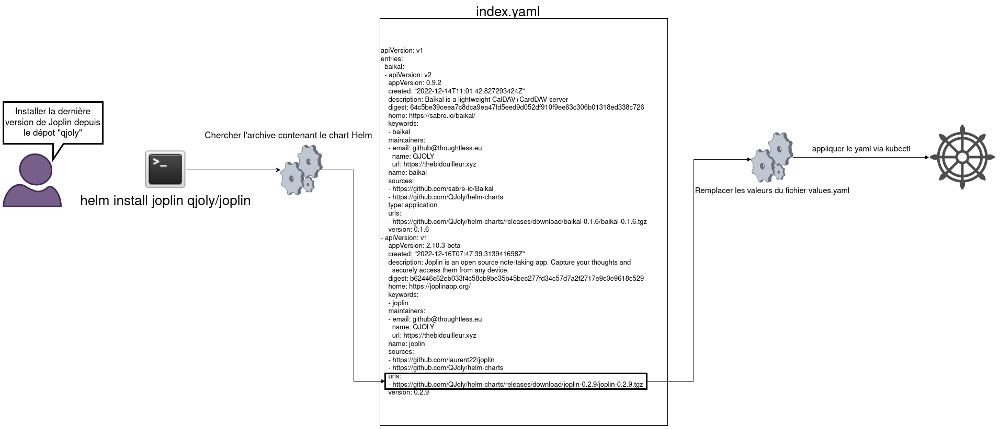
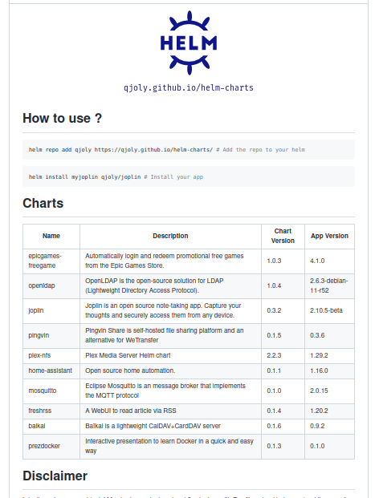

Bonne année, Bonne santé ! Que la réussite et la santé soient avec vous !
J'espère que cette année sera riche en découvertes techniques.

Mais avant d'être trop heureux, attaquons avec une mauvaise nouvelle :

## K8S@HOME est mort

### Qu'est-ce que K8S@HOME ?

*K8S-at-home* est le nom d'une communauté promouvant l'usage de Kubernetes comme *Homelab*. La communauté possédait un énorme dépôt Helm maintenu par quelques membres.
Sur ce dépôt Helm, on pouvait avoir la plupart des applications selfhosts utilisées dans les communautés Reddit/Discord. *(Plex, Firefly, Bitwarden etc…)*

**K8S@HOME permettait donc de déployer de nombreuses applications via Helm, sans s'embêter à écrire des charts.**

### La fin de K8S@HOME

[Si toute bonne chose a une fin : voici celle de K8S@HOME.](https://github.com/k8s-at-home/charts/issues/1761)
Suite au manque de contributeurs, le dépôt est archivé et les charts ne seront plus maintenus.

Pour l'instant, ça ne veut pas dire que les Helm déjà déployés à partir de *K8S@HOME* doivent être arrêtés : les images Docker sont choisies dans les fichiers *values.yaml*, et s'il y a faille → ce seront les images Docker qu'il faudra mettre à jour, pas le chart.

En revanche, avec le temps : nous auront de plus en plus d'instructions obsolètes et nous ne bénéficierons pas des nouvelles fonctionnalités prévues par Helm.

## La Solution : Créer notre dépôt Helm

Mais oui ! Tout comme nous prenons l'habitude de créer un registre Docker avec nos images. Nous pouvons créer un dépôt Helm avec nos charts.

### Fonctionnement d'un chart Helm

De base, un chart Helm se compose de différents fichiers YAML qui seront appliqués via kubectl après un traitement de "templating". Ce traitement permet de remplacer des valeurs dans les fichiers (Les utilisateurs de Jinja2 ne seront pas perdus) via le fichier **values.yaml** (qui contient les valeurs de remplacement) et les fichiers **_helpers.tpl** (qui contiennent des fonctions pour traiter les valeurs).

Une fois que les valeurs de remplacements sont appliquées sur la template, on envoie les modifications au cluster. (via kubectl ou en communiquant avec l'API).

Exemple rapide :

```yaml
#service.yml
apiVersion: v1
kind: Service
metadata:
  name: baikal
  labels:
    {{- include "baikal.labels" . | nindent 4 }}
spec:
  type: ClusterIP
  ports:
    - port: {{ .Values.service.port }}
      targetPort: http
      protocol: TCP
      name: http
  selector:
    {{- include "baikal.selectorLabels" . | nindent 4 }}
```

```yaml
#values.yml
service:
  type: ClusterIP
  port: 80
```

Les fonctions sont appelées par le mot clé "include", et les valeurs du fichier values.yml sont appelées via le préfixe ".Values".

Vous pourrez apprendre à faire des charts Helm en suivant l'excellente documentation de Stéphane Robert : [ici](https://blog.stephane-robert.info/post/kubernetes-write-first-chart-helm/)

### Fonctionnement d'un dépôt Helm

Lorsque l'on ajoute un dépôt, on peut directement voir les charts disponibles dans ce dépôt :

```bash
helm repo add qjoly https://qjoly.github.io/helm-charts\
helm search repo qjoly
```

C'est grâce au dépôt qui contient un fichier *index.yaml* qui va répertorier les charts disponibles et les URLs permettant de les télécharger.



Ainsi, lorsque l'on veut ajouter le chart "*Joplin*" dépôt "*qjoly*", notre client va aller chercher dans notre fichier *index.yaml* l'url de téléchargement (en *tar.gz*) du chart. Notre client Helm va ensuite faire le remplacement des valeurs avant d'envoyer le manifest dans notre cluster.

## Création d'un dépôt Helm

Pour créer un dépôt helm, voici les différentes solutions :

- [Utiliser ChartMuseum](https://chartmuseum.com/)  
- Utiliser l'image GitHub Action Chart-Releaser
- à la main (en créant le fichier index.yaml manuellement)

Nous, nous passerons par l'image GitHub Action *(je réserve une page sur ChartMuseum)*.

### Usage de GitHub Action pour générer les releases

```yml
       - name: Run chart-releaser
         uses: helm/chart-releaser-action@v1.5.0
         env:
           CR_TOKEN: "${{ secrets.GITHUB_TOKEN }}"            
```

:::tip Ne pas créer de secret

Il n'est pas nécessaire de créer un secret. *(celui-ci est automatiquement généré durant le CI)*

:::

Grâce à cette image, CR va chercher dans le dossier **charts/** pour générer l'*index.yaml* et le stocker directement dans la branche **gh-pages**. *(pensez à activer GitHub-pages pour que le site soit accessible à <https://votre-username.github.io/votre-projet>)*

L'avantage de Chart-Releaser est qu'il va automatiquement créer des releases pour chaque chart présent dans notre dépôt GitHub. Ce sont d'ailleurs ces mêmes releases qui seront accessibles depuis le fichier *index.yaml*.
En revanche, CR ne pourra pas mettre à jour une version déjà existante. Si nous voulons refaire la version 1.5 du chart "Baikal", il n'en fera rien. Il faudra manuellement supprimer la release/tag avant de relancer le CI.

```bash
curl https://qjoly.github.io/helm-charts/index.yaml
```

*Nous avons bien un fichier renvoyant les charts disponibles, une description, ainsi que l'URL où l'archive du chart est accessible.*

Il est très bien possible de se contenter de ça, mais puisque nous le pouvons : allons plus-loin !

## Tester les charts avant de générer la release. (CI)

Pour être sûr de ne pas envoyer des charts non fonctionnels, j'ai voulu m'appuyer sur du CI pour vérifier le bon-fonctionnement de mon code.

La première chose simple que nous pouvons faire... c'est d'utiliser le linter de Helm.

### Vérification de la syntaxe

Selon Wikipedia:
> Un linter est un outil qui analyse le code source pour signaler les erreurs de programmation, les bogues, les erreurs stylistiques et les constructions suspectes.

L'objectif est donc de vérifier (avant d'exécuter un code) que sa syntaxe est correcte et qu'il n'y a pas d'erreur évidente.
Nous pouvons directement taper la commande `helm lint .`.

Exemple :

```bash
➜  baikal git:(main) helm lint .
==> Linting .
[INFO] Chart.yaml: icon is recommended

1 chart(s) linted, 0 chart(s) failed
➜  baikal git:(main)  
```

Helm lint est CI-Friendly, il renvoie un exit-code différent de 0 lorsque le lintage (*c'est mon article, j'invente les mots que je veux)* n'est pas correct.

Pour tester l'intégralité de mes charts, j'ai écrit un petit script *helm_lint.sh* qui va effectuer la commande `helm lint .` dans chaque sous-dossier de *charts/*.

```bash
cd ../../charts
for d in *
do
  echo "Testing $d "
  (cd "$d" && helm lint )
  if [ $? -ne 0 ]; then
    echo "Error"
    exit 1
  fi
done
```

Ainsi, à la moindre erreur dans le script (*si le lintage est mauvais*), celui-ci s'arrête et renvoie l'exitcode à 1. *(Ce qui va stopper le CI et générer une erreur)*

---

Pour lancer ce script via GitHub Action, j'ai installé Helm via l'action *"azure/setup-helm"*.
Ce qui nous donne ces instructions à rajouter devant notre chart-releaser :

```yaml
       - uses: azure/setup-helm@v3
         with:
            token: ${{ secrets.GITHUB_TOKEN }} 
       
       - name: Helm Lint
         run: |
           cd .github/workflows/
           ./helm_lint.sh
```

### Vérification du fonctionnement des charts

Si vérifier le lint se fait en quelques secondes, il est également possible de lancer le chart directement depuis le CI Github.

Pour cela, il faut au préalablement créer un cluster Kubernetes *depuis Github Action*. Et si cela est possible, c'est grâce à *KIND* (*Kubernetes INside Docker*) qui permet de faire un cluster virtuel dans des conteneurs Docker en seulement quelques commandes.

À rajouter dans notre CI:

```yaml
       - name: Create k8s Kind Cluster
         uses: helm/kind-action@v1.5.0
```

Maintenant que nos charts ont une syntaxe correcte, que nous avons un cluster fonctionnel, il faut y installer nos programmes un-par-un et les tester individuellement.

Vous rappelez-vous de *helm_lint.sh* ? Voici son grand-frère : *helm_deploy.sh*.

```bash
cd ../../charts
for d in *
do
  echo "Deploying $d to kind"
  (
    set -x
    cd "$d"
    if [ -f ".no_ci" ]; then
      echo "No CI for this chart."
    else
      helm install $d . --wait --timeout 120s 
      helm test $d
    fi
  )
  if [ $? -ne 0 ]; then
    echo "Error during deployment"
    exit 1
  else
    echo "Success ! "
    helm delete $d || true 
  fi
done
```

L'exécution de ce script va déployer chaque chart individuellement en lançant la commande `helm test`, permettant de lancer des tests *(vérifier un port, vérifier le status d'une page web etc..)*.
Si le test échoue, `helm test` renverra un exitcode à 1, et le script créera une erreur.

J'ai également la vérification de la présence d'un fichier *.no_ci* qui, comme son nom l'indique, permet de "skip" un chart. Cela permet de ne pas déployer certains charts dans le cluster de test. *(Par exemple : mon chart plex-nfs qui ne peut pas fonctionner dans Github Action, ou un chart OpenLDAP)*.

:::caution Ressources ?

GitHub Action est limitée à 2000 minutes de CI mensuels. Avec une petite dizaine de charts, mes tests durent environ 5min. (soit 400 tests par mois)

Je suis conscient qu'à notre échelle : c'est suffisant. Mais à garder en tête si on commence à avoir un dépôt similaire à k8s-at-home.

:::

## Un README dynamique

Et pour rendre votre dépôt GitHub agréable pour vos utilisateurs, nous pouvons faire un **README** évoluant au fur et à mesure que vous créez vos charts.

L'idée est donc de créer un tableau comme celui-ci :

| Name  | Description | Chart Version | App Version |
|-------|-------------|---------------|-------------|
| baikal | Baïkal is a lightweight CalDAV+CardDAV server | 0.1.6 | 0.9.2 |

Ces informations *(nom, description, version)* sont toutes accessibles depuis les fichiers **Chart.yaml** présents dans nos charts.

```yaml
apiVersion: v2
name: baikal
description: Baïkal is a lightweight CalDAV+CardDAV server
type: application
version: 0.1.6
appVersion: "0.9.2"
keywords:
- baikal
home: https://sabre.io/baikal/
maintainers:
- email: github@thoughtless.eu
  name: QJOLY
  url: https://thebidouilleur.xyz
sources:
- https://github.com/sabre-io/Baikal
- https://github.com/QJoly/helm-charts
```

Du coup, vous rappelez-vous des scripts *helm_lint.sh* et *helm_deploy.sh* ? Eh bien voici le tonton : **get_readme.py**.

```python
#!/usr/bin/env python3
# -*- coding: utf-8 -*-

import sys, logging, os, yaml
from pathlib import Path
from glob import glob
from yaml.loader import SafeLoader
from jinja2 import Template

def main():
    files = glob('../../**/Chart.yaml', recursive=True)
    charts = []
    for chart in files:
        with open(chart) as f:
            data = yaml.load(f, Loader=SafeLoader)
            print(f"nom : {data['name']} \ndescription: {data['description']}\nversion chart: {data['version']}\nversion app: {data['appVersion']}")
            charts.append([data['name'],data['description'],data['version'], data['appVersion']])
    print(f"Nombre de charts: {len(charts)}")
    table_template=Path('table.j2').read_text()
    tm = Template(table_template)
    tableValue = tm.render({'charts':charts})
    print("----")
    readme_template=Path('./README.md.tmpl').read_text().replace("CHARTS_TABLE",tableValue).replace(""", '"')
    print(readme_template)
    Path("../../README.md").write_text(readme_template)

if __name__ == "__main__":
    main()
```

Ce script Python va récupérer les différentes balises contenues dans les *Charts.yaml*, puis va générer un tableau Markdown à partir du fichier *table.j2* (en jinja2, tout comme Helm), et va créer un README à partir du tableau ainsi que du fichier README.md.tmpl (contenant de la mise en page, et des informations supplémentaires).

Voici le résultat actuel :



à ajouter sur notre CI :

```yaml
       - name: Modifying the readme on main
         continue-on-error: true
         run: |
          git pull
          git checkout main
          cd .github/workflows/
          python -m pip install -r requirements.txt 
          python3 get_readme.py
          cd ../..
          git add README.md
          git commit -m ":lock: Auto-Update README with Charts versions"
          git push
```

## Créer une page d'accueil

Dans cet état, lorsque nous donnons l'URL du dépôt à ajouter aux clients helm de nos utilisateurs : ceux-ci accèderont sur une 404 (logique, le seul fichier créé est l'index.yaml).
Mon idée est de reprendre les mêmes informations du README pour l'afficher sous forme de page web.

Si à la base, je voulais créer un système similaire au README (mais en HTML), j'ai opté pour la conversion du Markdown en HTML. Et un outil très utilisé est : [pandoc](https://pandoc.org)

Nous allons donc utiliser Pandoc pour convertir notre readme en HTML, l'instruction est simple :

```yaml
       - name: Setup Pandoc
         uses: nikeee/setup-pandoc@v1
         
       - name: Modifying index.html
         continue-on-error: true
         run: |
          index=$(pandoc --from markdown_github README.md --to html5 --standalone --toc --citeproc --no-highlight)
          git checkout gh-pages
          echo $index > index.html
          git add index.html
          git commit -m "[AUTO] Update index.html of gh-pages"
          git push       
```

On ne peut pas dire que du grand art, mais le résultat est plutôt propre *(dieu merci, Pandoc intègre du CSS)*.


*Dans mon cas, je rajoute même mon script JS de compteur de vues à cette étape*.

## Conclusion

Créer un dépôt Helm avec les petites modifications que je vous propose ne fera pas de vous un grand développeur (?) de charts. Mais ces outils vous permettrons de vous faciliter le travail, et de proposer une expérience agréable pour les personnes utilisant vos codes.

Il est toujours possible d'aller de plus en plus loin. Je pense notamment à RenovateBot qui peut vous proposer des modifications *(ex: mettre à jour une image par défaut)*.

N'hésitez pas à me faire parvenir vos retours (mail/Twitter) ou vos propositions d'améliorations.

PS: [Pour obtenir le CI complet *(en reprenant chaque étape de cette page)*, vous pouvez visionner mon dépot ici.](https://github.com/QJoly/helm-charts/)
