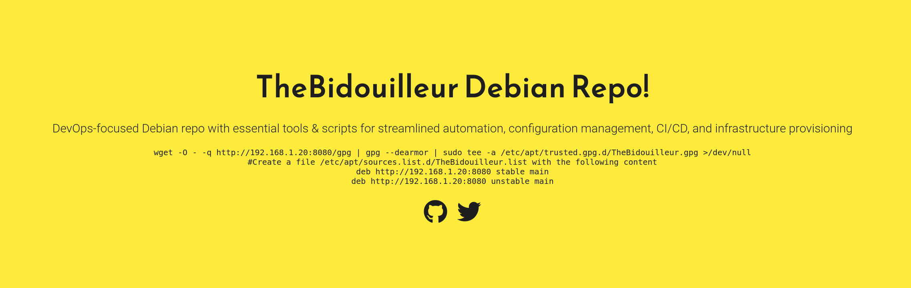

Si vous visitez régulièrement mon blog, vous avez sans doute remarqué que j'ai un faible pour les projets basés sur Docker. J'utilise Docker dans mes infrastructures pour la reproductibilité, la simplicité des déploiements et la facilité de maintenance. *(C'est d'ailleurs pour ces raisons que j'ai décidé de passer sur Kubernetes)*.

Cette année, j'ai écrit 2 pages permettant respectivement d'apprendre à créer des fichiers `.deb` et d'héberger un dépôt de paquets Debian avec `Aptly`. J'ai décidé de reprendre mon tutoriel concernant *Aptly* pour en faire un programme tout-en-un : [Simple Debian-Repository](https://github.com/QJoly/DebianRepository).

## Qu'est-ce que Simple Debian-Repository ?

Simple Debian-Repository est un projet en **Bash** qui va packager *un-par-un* les applicatifs dans `src` et les déposer dans `repo-list` sous forme de `.deb` avant de les publier sur un serveur web. Celui-ci gère également la signature des paquets en générant une clé GPG.

## Comment lancer le projet ?

Le projet est *plug and play*, il suffit de lancer le Docker pour que le script de démarrage crée la structure ainsi que la clé GPG. Une fois le dépôt créé, vous pouvez ajouter vos paquets dans le dossier `src` en respectant la nomenclature des fichiers `.deb`.

Exemple de lancement à partir d'un dossier vide :

<script async id="asciicast-N9JL3ih6jwoLJX4r58Y51NHlf" src="https://asciinema.org/a/N9JL3ih6jwoLJX4r58Y51NHlf.js"></script>

Par défaut, 2 programmes 'exemples' seront installés dans le dépôt : `hello-world` et `goodbye-world`. Vous pourrez les supprimer en effaçant les dossiers et `.deb` dans `src` et `repo-list`.

```bash
rm -r src/stable/hello-world src/unstable/goodbye-world/
rm repo-list/stable/hello-world_1.0.0-1_all.deb repo-list/unstable/goodbye-world_1.0.0-1_all.deb
```

## Comment ajouter un paquet ?

Le projet propose 2 dépôts par défaut : `stable` et `unstable`. Vous pouvez ajouter autant de dépôts que vous le souhaitez en créant un dossier dans `src` et `repo-list`:

```bash
mkdir -p src/testing repo-list/testing
```

Vous pourrez trouver ma documentation à propos de la création de paquets Debian [ici](docs/Adminsys/creer-deb).

Mon script va chercher les dossiers à packager dans `src/NOM_APP/NOM_APP_VERSION-REV_ARCH`. C.-à-d. que si vous voulez packager l'application `foo`, vous devez d'abord créer un dossier `foo` dans `src` et créer le dossier qui correspondra à la version du paquet. Par exemple, pour packager la version `1.0.0` de l'application `foo` à la révision 1, vous devrez créer le dossier `foo/foo_1.0.0-1_all` dans `src` et y placer les fichiers nécessaires à la création du paquet.

Exemple de création de paquet `foo` :

```bash
mkdir -p src/foo/foo_1.0.0-1_all
cd src/foo/foo_1.0.0-1_all
mkdir DEBIAN
touch DEBIAN/control
mkdir -p usr/bin
echo -e '#!/bin/bash\necho "bar"' > usr/bin/foo
chmod +x usr/bin/foo
```

## Customisation

*N'étant vraiment pas très bon en programmation web, j'ai utilisé le code de [Flexdinesh](https://github.com/flexdinesh/dev-landing-page) pour la page d'accueil.*

Lors du lancement du projet, celui-ci va créer une page web affichant les étapes permettant d'ajouter le dépôt à votre machine. Il existe 2 variables d'environnements pour personnaliser cette page :

- **REPO_NAME** : Nom du dépôt (celui-ci sera affiché dans la page d'accueil et permettra de nommer les fichiers dans les instructions)
- **WEB_URL**   : URL du dépôt (pour afficher la bonne URL dans les instructions)

Vous pourrez également modifier la couleur du fond de la page d'accueil en modifiant le fichier `index.html` dans le dossier `html`.

```html
<head>
 <meta charset="utf-8">
 <meta http-equiv="X-UA-Compatible" content="IE=edge">
 <meta name="viewport" content="width=device-width, initial-scale=1.0">

 <title>TheBidouilleur's repo</title>

 <link rel="icon" href="favicon.ico" type="image/png" />

 <link href="https://fonts.googleapis.com/css?family=Reem+Kufi|Roboto:300" rel="stylesheet">
 <link href="https://use.fontawesome.com/releases/v5.13.1/css/all.css" rel="stylesheet">
 <link rel="stylesheet" href="css/reset.css">
 <link rel="stylesheet" href="css/styles.css">
 <!-- <link rel="stylesheet" href="css/themes/indigo-white.css"> -->
 <!-- <link rel="stylesheet" href="css/themes/green-white.css"> -->
 <!-- <link rel="stylesheet" href="css/themes/red-white.css"> -->
 <!-- <link rel="stylesheet" href="css/themes/grey-white.css"> -->
 <!-- <link rel="stylesheet" href="css/themes/white-indigo.css"> -->
 <link rel="stylesheet" href="css/themes/white-blue.css"> 
 <!-- <link rel="stylesheet" href="css/themes/white-grey.css"> -->
 <!-- <link rel="stylesheet" href="css/themes/white-red.css"> -->
 <!-- <link rel="stylesheet" href="css/themes/yellow-black.css"> -->
</head>
```

Vous n'avez qu'à dé-commenter la ligne correspondant au thème de votre choix.



*Note si vous doutez de mon choix de couleur par défaut : je m'en fiche et je suis daltonien.* ;)
Tout comme le thème, les différents liens disponibles sur la page d'accueil doivent être modifiés dans le fichier `index.html`.

## Conclusion

[Simple Debian-Repository](https://github.com/QJoly/DebianRepository) est un projet qui permet de déployer rapidement un dépôt de paquets Debian. Il est très simple à utiliser et à personnaliser. Si vous avez des suggestions d'amélioration, n'hésitez pas à me contacter sur Twitter ou à ouvrir une issue sur le projet. Celui-ci n'est pas adapté à un usage en production, mais il me suffit pour mes besoins personnels.

En créant ce projet, j'ai également créé un second projet, [src-packages-deb](https://github.com/QJoly/src-packages-deb) pour stocker certaines applications avant de les packager en `.deb`. N'hésitez pas à y jeter un œil si vous souhaitez contribuer ou peupler votre dépôt avec quelques applications.
