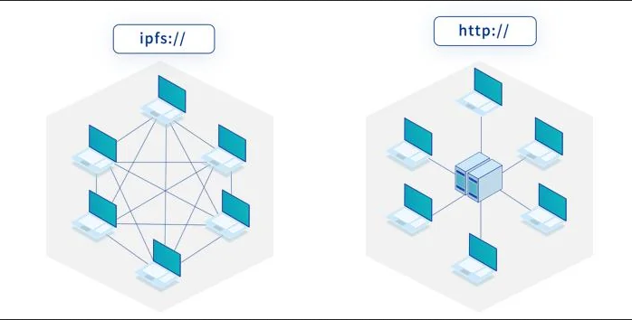
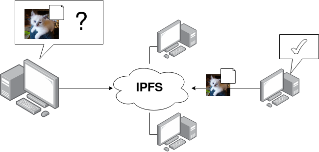
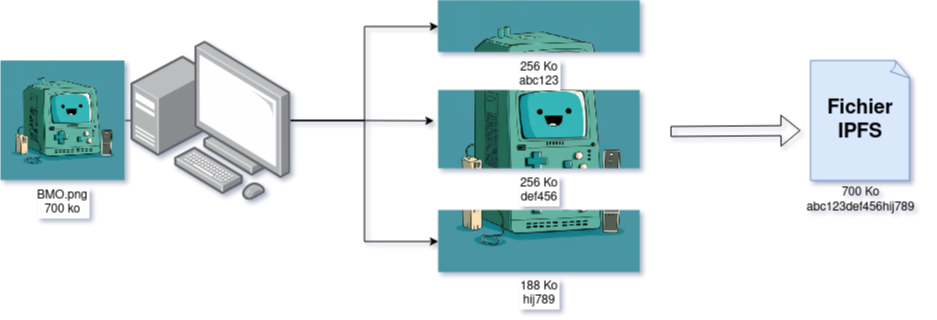
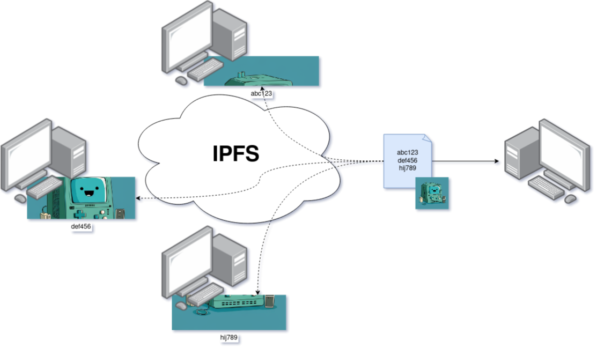

L'IPFS *(InterPlanetary File System)* est un protocole **P2P** *(Peer to Peer)* permettant de diffuser des fichiers de manière décentralisée.

La mention "InterPlanetary" nous donne l'objectif premier de l'IPFS : surmonter les difficultés techniques et les contraintes de la communication entre planètes.

<!--more-->

En effet, le jour où Mars sera colonisé, le web devra s'adapter pour permettre à tous de pouvoir accéder au même internet. Car si nous arrivons à afficher Wikipédia en quelques millisecondes sur nos ordinateurs, **4min** seront nécessaires depuis Mars *dans les meilleures conditions* et **48 min** *si vous êtes malchanceux*.

Imaginez 48 minutes pour vous rappeler que Georges Lucas a eu un caméo dans *Le Flic de Beverly Hills 3*.

Et c'est à ce moment précis que l'IPFS entre en scène. Comme c'est un système de partage de fichiers entre ordinateurs qui fonctionne **sans serveurs centraux**, il ne sera pas toujours nécessaire de communiquer avec un serveur terrien pour lire une page web.

Ce protocole est un mélange entre le *World Wide Web* et Bit Torrent avec lequel un même fichier peut être partagé par plusieurs ordinateurs. Le réseau IPFS est donc une carte sur laquelle nous allons demander un fichier (site) et le télécharger depuis un serveur proche qui n'est pas forcément le serveur dont provient la donnée.

[](https://www.reddit.com/r/ipfs/comments/q76uil/what_is_ipfs_what_does_it_mean_for_the_internet/)

## Comment accéder à un fichier ?

En Web classique, nous demandons à un serveur un fichier spécifique via une URL qui renvoie vers un fichier spécifique. Si jamais nous revenons plus tard : le fichier ne sera pas forcément le même.


En IPFS, nous allons directement demander un fichier à partir d'un identifiant qui se base sur son contenu : un **CID** *(Content Identifier)*, c'est un Hash unique permettant d'identifier votre donnée.



Dès lors que nous envoyons un fichier dans le réseau IPFS, nous obtenons un CID qui pointe vers celui-ci.

## Cycle de vie d'un fichier

Si je souhaite envoyer mon image de profil dans le réseau IPFS, celle-ci va être séparée en plusieurs parties de (maximum) 256 ko. Nous calculons ensuite un Hash unique pour chaque morceau, et nous les combinons pour créer le **CID** du fichier complet.



Le CID est alors une entité qui contient les différents Hash des morceaux de ~256 ko permettant de reconstituer le fichier d'origine.

Le fait de séparer un fichier en plusieurs blocs permet de faire de la **déduplication**. Si je stocke de nouveau mon image en ayant modifié que le haut du png : je peux réutiliser les blocs identiques et n'ajouter que la différence en IPFS. Le CID sera quand même différent *(le hash des premiers blocs seront modifiés)*.

Il est donc possible de reconstituer un fichier complet en utilisant les parties présentes dans le réseau IPFS.



## Installer un client IPFS


[Kubo](https://github.com/ipfs/kubo) est l'utilitaire le plus connu et le plus utilisé pour communiquer en IPFS. Il est écrit en **Golang** et peut s'utiliser en ligne de commande, ou via une interface web.

Il s'installe de manière assez simple :

```mdx-code-block
import Tabs from '@theme/Tabs';
import TabItem from '@theme/TabItem';

<Tabs>
  <TabItem value="Alpine" label="Alpine" default>

    apk add kubo

  </TabItem>
  <TabItem value="Build à partir du code" label="Debian/Ubuntu" default>

    git clone https://github.com/ipfs/kubo.git
    cd kubo
    make install

  </TabItem>
  <TabItem value="Nix" label="Nix">

    nix-env -i kubo -v

  </TabItem>
  <TabItem value="Télécharger Binaire" label="Binaire">

    wget https://dist.ipfs.tech/kubo/v0.20.0/kubo_v0.20.0_linux-amd64.tar.gz
    tar xvfz kubo_v0.20.0_linux-amd64.tar.gz
    ./install.sh
  
  </TabItem>
</Tabs>
```

N'appréciant pas l'usage d'interfaces webs, je vais uniquement présenter l'utilitaire en ligne de commande et non l'interface web.

## L'IPFS en pratique

Je dispose de 2 machines virtuelles sur lesquelles j'ai installé IPFS.

Première chose que nous pouvons faire, c'est de stocker un fichier sur le réseau IPFS. La commande est simple : `ipfs add <fichier>`. Cela va nous retourner un hash qui correspond à notre fichier. Ce hash est unique et permet de retrouver notre fichier sur le réseau IPFS.

Avant tout, chacune des machines aura initialisé son client IPFS avec la commande `ipfs init`.

Je crée un fichier `hello.txt` avec le contenu *"Bonjour !"*. L'utilitaire `ipfs add` ajoute ce fichier sur notre nœud IPFS.

```bash
# machine 1
➜ ipfs add hello.txt 
added QmNURZjTooDCUKjtegXUDF8CeowSN8VLSnPARLGXnxiv11 hello.txt
```

```bash
# machine 2
➜ ipfs cat QmNURZjTooDCUKjtegXUDF8CeowSN8VLSnPARLGXnxiv11
Error: block was not found locally (offline): ipld: could not find QmNURZjTooDCUKjtegXUDF8CeowSN8VLSnPARLGXnxiv11
```

La raison ? C'est simple : **Aucune des machines n'est reliée au réseau IPFS.** !

Pour cela, il faut lancer le daemon via la commande `ipfs daemon` sur les deux machines.
Une fois la commande lancée, on peut lire le fichier sur la machine 2 :

```bash
# machine 2
➜ ipfs cat QmNURZjTooDCUKjtegXUDF8CeowSN8VLSnPARLGXnxiv11
Bonjour ! 
```

Donc dans cette configuration, le fichier `hello.txt` est hébergé par le nœud IPFS sur la machine 1 et la machine 2 y accède.

Maintenant, faisons une simple expérience, éteignons la machine 1, et tentons d'accéder une nouvelle fois au fichier :

```bash
# machine 2
➜ ipfs cat QmNURZjTooDCUKjtegXUDF8CeowSN8VLSnPARLGXnxiv11
Bonjour ! 
```

Le fichier est toujours accessible ! Cela s'explique par l'existence d'un cache sur notre client. Ce cache est paramétrable via le fichier de configuration situé à cet emplacement `~/.ipfs/config`.

```json
...
  "Datastore": {
    "StorageMax": "10GB",
    "StorageGCWatermark": 90,
    "GCPeriod": "1h",
...
```

Nous avons un cache maximum de 10 Go. Le *garbage collector* supprimera ce cache dès lors que nous utilisons plus de 90% du `StorageMax`.

En dehors de permettre à la machine 2 de lire ce fichier, ce cache a également une autre utilité.

Ajoutons une 3ème machine virtuelle et tentons d'accéder au fichier `QmNURZjTooDCUKjtegXUDF8CeowSN8VLSnPARLGXnxiv11`. *(Sachant que la machine 1 est toujours éteinte, celle-ci ne pourra pas envoyer le fichier)*

```bash
# machine 3
➜ ipfs cat QmNURZjTooDCUKjtegXUDF8CeowSN8VLSnPARLGXnxiv11
Bonjour ! 
```

Le cache permet ainsi de participer à la diffusion de ce fichier *(sans être le nœud de première diffusion)*.

À l'inverse *(en ayant supprimé le cache de machine 3)*, si jamais j'éteins la machine 1 et 2 : le fichier devient **injoignable** :

```bash
# machine 3
➜ ipfs cat QmNURZjTooDCUKjtegXUDF8CeowSN8VLSnPARLGXnxiv11
(Pas de réponse)
```

En résumé : Il faut toujours une machine stockant ce fichier sur le réseau IPFS pour pouvoir accéder aux données.

Mais le cache est éphémère ! Ne comptez pas dessus pour relayer votre fichier.

Pour demander à une machine de garder le fichier et de le partager, il est nécessaire que l'on **PIN** le fichier.

Revenons au stade initial : `hello.txt` sur *machine 1*, et rien sur machine 2 et 3.

Nous allons demander à la machine 2 de pin notre CID pour que celui-ci soit stockée en dehors du cache et devienne persistant sur *machine 2*.

```bash
# machine 2
➜ ipfs pin add QmNURZjTooDCUKjtegXUDF8CeowSN8VLSnPARLGXnxiv11
pinned QmNURZjTooDCUKjtegXUDF8CeowSN8VLSnPARLGXnxiv11 recursively
```

Éteignons de nouveau *machine 1* et tentons *(encore une fois)* de lire le fichier `hello.txt` sur la machine 3 :

```bash
# machine 3
➜ ipfs cat QmNURZjTooDCUKjtegXUDF8CeowSN8VLSnPARLGXnxiv11
Bonjour !
```

Le fichier est maintenant lisible tant que machine 1 **ou** machine 2 sont sur le réseau IPFS.

## Récupérer un fichier sur le réseau IPFS sans client

Il existe de nombreuses passerelles publiques permettant d'accéder à un fichier du réseau IPFS sans se connecter à un client. Le CID de mon fichier étant `QmNURZjTooDCUKjtegXUDF8CeowSN8VLSnPARLGXnxiv11`, je peux lire le fichier depuis Firefox via cette URL : `https://ipfs.io/ipfs/QmNURZjTooDCUKjtegXUDF8CeowSN8VLSnPARLGXnxiv11`.

Si vous utilisez l'utilitaire et que vous avez installé l'extension `IPFS Companion` (disponible [ici](https://docs.ipfs.tech/install/ipfs-companion/)), vous pouvez utiliser une passerelle locale via cette URL : `localhost:8080/ipfs/QmNURZjTooDCUKjtegXUDF8CeowSN8VLSnPARLGXnxiv11`


Et puisque nous utilisons notre navigateur… rien ne nous empêche de lire du HTML !

Mon blog étant sous [Docusaurus](https://docusaurus.io/), je vais alors build le site et l'ajouter à mon nœud IPFS: 

```bash
git clone https://github.com/QJoly/TheBidouilleur.xyz
cd TheBidouilleur.xyz
npm i
npm run build
ipfs add -r ./build
```

J'obtiens le CID `QmXqrXHXuKB9tHrxUgNphRx8TyKBmtrisuRB2y9FkFta7x` et j'accède à mon site via cette URL : `http://localhost:8080/ipfs/QmXqrXHXuKB9tHrxUgNphRx8TyKBmtrisuRB2y9FkFta7x` ou `https://ipfs.io/ipfs/https://ipfs.io/ipfs/QmXqrXHXuKB9tHrxUgNphRx8TyKBmtrisuRB2y9FkFta7x/` *(Attention aux erreurs de CSS. Mon Docusaurus n'aime pas ne pas être à la racine du site)*.


:::note Pin un dossier

À noter qu'il n'est pas nécessaire de PIN chaque élément du dossier. Il suffit uniquement de le faire sur le dossier racine du site (`QmXqrXHXuKB9tHrxUgNphRx8TyKBmtrisuRB2y9FkFta7x` dans mon cas). Les fichiers à l'intérieur du répertoire auront un 'pin indirect'.

```bash
➜ ipfs pin add QmXqrXHXuKB9tHrxUgNphRx8TyKBmtrisuRB2y9FkFta7x
pinned QmXqrXHXuKB9tHrxUgNphRx8TyKBmtrisuRB2y9FkFta7x recursively
➜ ipfs pin ls
Qmce2mdHr1ufcGqtnR67DdshJqPCpZ6bSrXxuzQJdga1dy indirect
QmdGAYHsqhxiwNDhkoCR5ryrd74wxGKhcgfsh9NJg5ANqH recursive  <-- Un dossier
QmcwA7f9HRwVVMMgJRt4mDbGLbr8jruyGPJxPYmWKhFqs2 indirect
QmednJCZK9SnxAy12rreveUqsMyP7Jfw2Aij1hFGWc3BJu indirect
```

:::


**ipfs.io** est une passerelle, c'est un accès *depuis le web* permettant de lire un fichier sur le réseau IPFS. Il en existe de nombreuses, et nous verrons plus bas comment créer la nôtre.

Maintenant, le problème d'héberger un site sur l'IPFS est que chaque fichier est immuable *(chaque entité se lit à l'aide son hash unique)*. Il n'est alors pas possible de modifier vos fichiers en gardant le même **CID** (et en conséquent : en changeant l'URL d'accès), vos utilisateurs devront donc utiliser le nouveau CID pour voir la dernière version de votre site.

C'est pour cela qu'il existe une solution : **InterPlanetary Name System** *(IPNS)*.

L'**IPNS** permet de faire pointer une URL vers un CID, nous pouvons mettre à jour à tout moment vers quel CID notre IPNS redirige.

Cette URL se forme à partir d'une clé *(qui permet de vous identifier sur le réseau IPFS)*. Dès lors que vous communiquez sur le réseau : vous utilisez une clé ed25519 (`ipfs key list`) nommée `self`.

Si vous souhaitez utiliser plusieurs IPNS, il est disponible d'en gérer plusieurs *(et donc d'obtenir plusieurs 'domaines')*, exemple:

```bash
➜ ipfs key gen --type=rsa --size=2048 mykey
```

Pour rediriger notre IPNS *(à partir de la clé `self`)* vers un CID, il faut utiliser l'argument `publish` :

```bash
➜ ipfs name publish /ipfs/QmXqrXHXuKB9tHrxUgNphRx8TyKBmtrisuRB2y9FkFta7x
Published to k51qzi5uqu5dl8idfkamiq22x12pr1rlha4i1izbi2hq5nlv3vuqt7nztq4krf: /ipfs/QmXqrXHXuKB9tHrxUgNphRx8TyKBmtrisuRB2y9FkFta7x
```

ou en spécifiant la clé :

```bash
➜ ipfs name publish --key=mykey /ipfs/QmXqrXHXuKB9tHrxUgNphRx8TyKBmtrisuRB2y9FkFta7x
Published to k2k4r8jfpj0rsylz08ahbkar950da3a77wfcreiwh85hnp9op504l0e0: /ipfs/QmXqrXHXuKB9tHrxUgNphRx8TyKBmtrisuRB2y9FkFta7x
```

:::danger
Attention, la syntaxe du CID est bien **/ipfs/CID**.
:::

Pour vérifier vers quoi un IPNS pointe, je peux faire un équivalent de `nslookup` via `ipns name resolv` :

```bash
➜ ipfs name resolve k51qzi5uqu5dl8idfkamiq22x12pr1rlha4i1izbi2hq5nlv3vuqt7nztq4krf
/ipfs/QmfEyL1zeaL7fWb6ugfzzh7zzdyyP7zSkb5smAyhttuQKS
```


:::warn

Durant l'écriture de cette article, **aucune passerelle publique** n'a réussi à m'afficher mon blog en utilisant mon **IPNS**.
J'ai dû moi même héberger ma propre gateway *(Nous verrons la démarche plus bas)*

[Liste des gateways publiques](https://ipfs.github.io/public-gateway-checker/)
:::

Mais retenir par cœur une clé est *(légèrement)* compliqué, il est alors possible d'utiliser votre propre nom de domaine en tant qu'IPNS. Pour cela, il suffit d'ajouter une entrée **TXT** à votre nom de domaine:

```conf
ipfs.thebidouilleur.xyz.	60	IN	TXT	"dnslink=/ipfs/QmXqrXHXuKB9tHrxUgNphRx8TyKBmtrisuRB2y9FkFta7x"
```

```bash
➜ ipfs name resolve ipfs.thebidouilleur.xyz
/ipfs/QmfEyL1zeaL7fWb6ugfzzh7zzdyyP7zSkb5smAyhttuQKS
```

:::note

Au lieu de mapper votre domaine vers un CID, il est également possible d'utiliser une clé IPNS :

```conf
ipfs.thebidouilleur.xyz.	60	IN	TXT	"dnslink=/ipns/k51qzi5uqu5di2e4jfi570at4g7qnoqx1vwsd2wc0pit1bxgxn22xwsaj5ppfr"
```

Il vous suffira donc de mettre à jour vers quel CID cet IPNS pointe via `ipfs name publish`.
:::

Une instance de mon blog est ainsi joignable depuis IPFS :

- Extension IPFS: `ipfs.thebidouilleur.xyz`
- Depuis une gateway : `ipfs.io/ipns/ipfs.thebidouilleur.xyz` *(Non-fonctionnel pour moi)*

## Héberger une gateway IPFS

Comme expliqué un peu plus haut, je ne parviens pas à résoudre les IPNS via les passerelles publiques.

J'ai dû alors me tourner vers la création de ma propre passerelle :

Il suffira d'initier votre configuration comme ci-dessus et de modifier votre configuration comme cela :

```bash
➜ ipfs config --bool Swarm.RelayService.Enabled true 
➜ ipfs config --bool Swarm.RelayClient.Enabled true
➜ ipfs config AutoNAT.ServiceMode '"enabled"' --json
➜ ipfs config Addresses.Gateway "/ip4/0.0.0.0/tcp/8080"
```

Une fois ces commandes lancées, vous pourrez directement récupérer des objets IPFS dans votre navigateur via la même syntaxe que les autres passerelles. Ex: `http://192.168.128.10:8080/ipns/k51qzi5uqu5di2e4jfi570at4g7qnoqx1vwsd2wc0pit1bxgxn22xwsaj5ppfr`.

## Dépôt Git en IPFS

En scrutant [la documentation](https://docs.ipfs.tech/how-to/host-git-repo/), j'ai trouvé cette page qui présente une procédure simple permettant de stocker un dépôt Git en *ReadOnly*.

Nous récupérons alors un dépôt avec l'argument `--mirror` permettant de récupérer le dépôt sous forme d'objets compressés. *(l'équivalent du dossier `.git` d'un dépôt)

```bash
git clone --mirror https://github.com/qjoly/helm-charts
```

Si (comme je viens de le faire) vous avez cloné votre dépôt en HTTPS *(et non SSH)*, il vous faudra générer des fichiers auxiliaires via la commande `git update-server-info`. Ces fichiers générés ou mis à jour par `git update-server-info` sont nécessaires pour que les clients Git puissent récupérer les objets et les références du dépôt.

```bash
git update-server-info
```

Nous ajoutons maintenant le dossier cloné à notre nœud IPFS :

```bash
ipfs add -r ./helm-charts.git
added QmbRUdVtdtxcpdqyJE3iZwTJq7FPcXR1ErQRFB76sQCg9H helm-charts.git/HEAD
added QmWadTGKYEjYf5Y7wKS66fLrTQm3ViH34QFoxbu88CbkG1 helm-charts.git/config
added Qmdy135ZFG4kUALkaMhr6Cy3VhhkxyAh264kyg3725x8be helm-charts.git/description
added QmUJ43sv5NVRBmfPHBwEitpz6D46xh4E79ponctVXEeMSH helm-charts.git/hooks/applypatch-msg.sample
added QmeuAksU8iLW2YeirL69ibjGxkNUjWkKq5iEvWhSdeRRXF helm-charts.git/hooks/commit-msg.sample
added QmV1Jv4eQcHrYtf97nofmUjzaaa6hmVXVt4LsqeG3hQKx8 helm-charts.git/hooks/fsmonitor-watchman.sample
added QmWkzb9d617XFnahXuorAQPxRMGA8TeZB7Vyq2oBMmW52d helm-charts.git/hooks/post-update.sample
added QmdgKBitxhbQ3APZt3CFAnfJUMCNC5uoGLkwjgbHciKPA8 helm-charts.git/hooks/pre-applypatch.sample
added QmVpNrG3G8aMcdScqwAkiKan2ACx6bfR35Dn9XJ2mw3LCC helm-charts.git/hooks/pre-commit.sample
added QmPep4RB3J5ERq3wrwEKFLznjnJeeFPqHZUjqcT3mCHej6 helm-charts.git/hooks/pre-merge-commit.sample
added QmQ52euRcb4YZf8PYfajNPQAuaW8WoBgzAksUqHLLttqjk helm-charts.git/hooks/pre-push.sample
added QmaTMXXEbvRSmpDTKqXf6kH3yeb7TNbiu3jttyYCbFpobD helm-charts.git/hooks/pre-rebase.sample
added QmNgDPe6oFz5jqqqdh9YhuqReBWkuPo6gsy45nHB6mSr2j helm-charts.git/hooks/pre-receive.sample
added QmPgMWyjZR1FzFaB1bYAWKkYLTtC5b6DGFVKroQp5eT7Ee helm-charts.git/hooks/prepare-commit-msg.sample
added QmW7VnBMgFcJNVCKfSNZRL5apU8X19mp7bsL8px6zjbmGn helm-charts.git/hooks/push-to-checkout.sample
added QmdBgUSUM2gmuHYMsk8Xy8AkWU5orkGKeBdK9JjfSCM2tC helm-charts.git/hooks/update.sample
added QmcfzxUpw36y8fu2GR3s7Vgq7RBgooKtc6BgsqFnadsDLc helm-charts.git/info/exclude
added QmW2BhLpMEmyhmvVi5xfRcym54NQEH5RfsqAyaL47NKzr1 helm-charts.git/info/refs
added QmYFqkUdpTZ2TwbpRwnyo7K4zMu8Ep9wWTpKELxHS33qiQ helm-charts.git/objects/info/packs
added QmPd9zs6bXigRrxEfLgpdV7nRmGF6UDgGLBiU4jz1zyfm8 helm-charts.git/objects/pack/pack-7d12aca4cae291e85bdb043dcbc34cc5ecf55d2d.idx
added QmX7zrvm2e2cAkLiakS4r8bqWTW7u8onxLuS4BXNUrBzSz helm-charts.git/objects/pack/pack-7d12aca4cae291e85bdb043dcbc34cc5ecf55d2d.pack
added QmZ9Es1CLRGWzasb4w3QRfvUi7NowtA78QKVuZahrMF1ix helm-charts.git/packed-refs
added QmUNLLsPACCz1vLxQVkXqqLX5R1X345qqfHbsf67hvA3Nn helm-charts.git/branches
added QmUDWwEzg33DPr6NNxeBDKgHKaTcDfbVfJrog6HpzLXTvg helm-charts.git/hooks
added QmXpvGWuzK8rPGrC7sDGsy7USx6v5mWgm1zfD2FGek5mwT helm-charts.git/info
added QmPmEe7i3mFqU1DfkENkkH1to3QrWJD5UGSNJ7tmQ3cCUy helm-charts.git/objects/info
added QmaodTHHrn5BZY8zaq4Lpj5Af4CmnQKbYract1aadwP8Aq helm-charts.git/objects/pack
added QmfBTRmFNY3t5UP4s2bRFtmNAi4jiffcHBiokxxLeVEjzE helm-charts.git/objects
added QmUNLLsPACCz1vLxQVkXqqLX5R1X345qqfHbsf67hvA3Nn helm-charts.git/refs/heads
added QmUNLLsPACCz1vLxQVkXqqLX5R1X345qqfHbsf67hvA3Nn helm-charts.git/refs/tags
added QmWYtSEta2Fzgy4u4ttdwwiKMUikwZrFHxa5quWXMVyBhy helm-charts.git/refs
added QmVeBgcRdV5AapyRa8wcfLsk8y4xWxAL93mTmyCdrEynR5 helm-charts.git
 491.68 KiB / 491.68 KiB [========================================================================================================================================================]
```

Nous pouvons maintenant cloner notre dépôt via notre nœud local :

```bash
# via notre passerelle locale
git clone http://QmVeBgcRdV5AapyRa8wcfLsk8y4xWxAL93mTmyCdrEynR5.ipfs.localhost:8080 helm-charts
# via une passerelle publique
git clone https://ipfs.io/ipfs/QmVeBgcRdV5AapyRa8wcfLsk8y4xWxAL93mTmyCdrEynR5/
```

## Conclusion