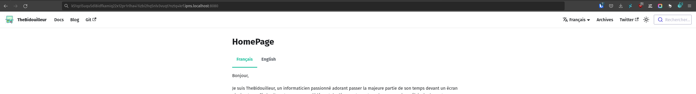

## Introduction


## La base

 https://www.reddit.com/r/ipfs/comments/q76uil/what_is_ipfs_what_does_it_mean_for_the_internet/


## Explication fonctionnement

## Les PINs

## Avantages / Défauts

## La pratique

### 


Je dispose de 2 machines virtuelles sur lesquelles j'ai installé IPFS.

Première chose que nous pouvons faire, c'est de stocker un fichier sur le réseau IPFS. La commande est simple : `ipfs add <fichier>`. Cela va nous retourner un hash qui correspond à notre fichier. Ce hash est unique et permet de retrouver notre fichier sur le réseau IPFS.

Avant tout, chacune des machines aura initialisé son client IPFS avec la commande `ipfs init`.

Je crée un fichier `hello.txt` avec le contenu *"Bonjour !"*. L'utilitaire `ipfs add` ajoute ce fichier sur notre nœud IPFS.

```bash
# machine 1
➜ ipfs add hello.txt 
added QmNURZjTooDCUKjtegXUDF8CeowSN8VLSnPARLGXnxiv11 hello.txt
```

```bash
# machine 2
➜ ipfs cat QmNURZjTooDCUKjtegXUDF8CeowSN8VLSnPARLGXnxiv11
Error: block was not found locally (offline): ipld: could not find QmNURZjTooDCUKjtegXUDF8CeowSN8VLSnPARLGXnxiv11
```

La raison ? C'est simple : **Aucune des machines n'est reliée au réseau IPFS.** ! 

Pour cela, il faut lancer le daemon via la commande `ipfs daemon` sur les deux machines.
Une fois la commande lancée, on peut re-essayer de lire le fichier sur la machine 2 : 

```bash
# machine 2
➜ ipfs cat QmNURZjTooDCUKjtegXUDF8CeowSN8VLSnPARLGXnxiv11
Bonjour ! 
```

Donc dans cette configuration, le fichier `hello.txt` est hébergé par le nœud IPFS sur la machine 1 et la machine 2 y accède.

Maintenant, faisons une simple expérience, éteignons la machine 1, et tentons d'accéder une nouvelle fois au fichier :

```bash
# machine 2
➜ ipfs cat QmNURZjTooDCUKjtegXUDF8CeowSN8VLSnPARLGXnxiv11
Bonjour ! 
```

Le fichier est toujours accessible ! Cela s'explique par l'existence d'un cache sur notre client. Ce cache est paramétrable via le fichier de configuration situé à cet emplacement `~/.ipfs/config`.

```json
...
  "Datastore": {
    "StorageMax": "10GB",
    "StorageGCWatermark": 90,
    "GCPeriod": "1h",
...
```

Nous avons un cache maximum de 10GB. Le *garbage collector* supprimera ce cache dès lors que nous utilisons plus de 90% du `StorageMax`.

En dehors de permettre à la machine 2 de lire ce fichier, ce cache a également une autre utilité.

Ajoutons une 3ème machine virtuelle et tentons d'accéder au fichier `QmNURZjTooDCUKjtegXUDF8CeowSN8VLSnPARLGXnxiv11`. *(Sachant que la machine 1 est toujours éteinte, celle-ci ne pourra pas envoyer le fichier)*

```bash
# machine 3
➜ ipfs cat QmNURZjTooDCUKjtegXUDF8CeowSN8VLSnPARLGXnxiv11
Bonjour ! 
```

Le cache permet ainsi de participer à la diffusion de ce fichier *(sans être le nœud de première diffusion)*.

À l'inverse *(en ayant supprimé le cache de machine 3)*, si jamais j'éteins la machine 1 et 2 : le fichier devient **injoignable** :

```bash
# machine 3
➜ ipfs cat QmNURZjTooDCUKjtegXUDF8CeowSN8VLSnPARLGXnxiv11
(Pas de réponse)
```

En résumé : Il faut toujours une machine stockant ce fichier sur le réseau IPFS pour pouvoir accéder aux données.

Mais le cache est éphémère ! Ne comptez pas dessus pour relayer votre fichier.

Il faut donc que l'on **PIN** le fichier.

Revenons au stade initial : `hello.txt` sur *machine 1*, et rien sur machine 2 et 3.

Nous allons demander à la machine 2 de pin notre donnée pour que celle-ci soit stockée en dehors du cache et devienne persistante sur *machine 2*.

```bash
# machine 2
➜ ipfs pin add QmNURZjTooDCUKjtegXUDF8CeowSN8VLSnPARLGXnxiv11
pinned QmNURZjTooDCUKjtegXUDF8CeowSN8VLSnPARLGXnxiv11 recursively
```

Éteignons de nouveau *machine 1* et tentons *(encore une fois)* de lire le fichier `hello.txt` sur la machine 3 :

```bash
# machine 3
➜ ipfs cat QmNURZjTooDCUKjtegXUDF8CeowSN8VLSnPARLGXnxiv11
Bonjour !
```

Le fichier est accessible !

## Récupérer un fichier sur le réseau IPFS sans client

Il existe de nombreuses passerelles publiques permettant d'accéder à un fichier du réseau IPFS sans se connecter à un client. Le CID de mon fichier étant `QmNURZjTooDCUKjtegXUDF8CeowSN8VLSnPARLGXnxiv11`, je peux lire le fichier depuis Firefox via cette URL : `https://ipfs.io/ipfs/QmNURZjTooDCUKjtegXUDF8CeowSN8VLSnPARLGXnxiv11`.

Si vous utilisez l'utilitaire et que vous avez installé l'extension `IPFS Companion` (disponible [ici](https://docs.ipfs.tech/install/ipfs-companion/)), vous pouvez utiliser une passerelle locale via cette URL : `localhost:8080/ipfs/QmNURZjTooDCUKjtegXUDF8CeowSN8VLSnPARLGXnxiv11`


Et puisque nous utilisons notre navigateur… rien ne nous empêche de lire du HTML !

Mon blog étant sous [Docusaurus](https://docusaurus.io/), je vais alors build le site et l'ajouter à mon nœud IPFS: 

```bash
git clone https://github.com/QJoly/TheBidouilleur.xyz
cd TheBidouilleur.xyz
npm i
npm run build
ipfs add -r ./build
```

J'obtiens le CID `QmXqrXHXuKB9tHrxUgNphRx8TyKBmtrisuRB2y9FkFta7x` et j'accède à mon site via cette URL : `http://localhost:8080/ipfs/QmXqrXHXuKB9tHrxUgNphRx8TyKBmtrisuRB2y9FkFta7x` ou `https://ipfs.io/ipfs/https://ipfs.io/ipfs/QmXqrXHXuKB9tHrxUgNphRx8TyKBmtrisuRB2y9FkFta7x/` *(Attention aux erreurs de CSS. Mon Docusaurus n'aime pas ne pas être à la racine du site)*.


:::note Pin un dossier

À noter qu'il n'est pas nécessaire de PIN chaque élément du dossier. Il suffit uniquement de le faire sur le dossier racine du site (`QmXqrXHXuKB9tHrxUgNphRx8TyKBmtrisuRB2y9FkFta7x` dans mon cas).
```bash
➜ ipfs pin add QmXqrXHXuKB9tHrxUgNphRx8TyKBmtrisuRB2y9FkFta7x
pinned QmXqrXHXuKB9tHrxUgNphRx8TyKBmtrisuRB2y9FkFta7x recursively
➜ ipfs pin ls
Qmce2mdHr1ufcGqtnR67DdshJqPCpZ6bSrXxuzQJdga1dy indirect
QmdGAYHsqhxiwNDhkoCR5ryrd74wxGKhcgfsh9NJg5ANqH recursive  <-- Un dossier
QmcwA7f9HRwVVMMgJRt4mDbGLbr8jruyGPJxPYmWKhFqs2 indirect
QmednJCZK9SnxAy12rreveUqsMyP7Jfw2Aij1hFGWc3BJu indirect
```

:::

Maintenant, le problème d'héberger un site sur l'IPFS est que chaque fichier est immuable ! *(puisque chaque fichier est accessible via son hash unique)*

C'est pour cela qu'il existe une solution : InterPlanetary Name System *(IPNS)*.

L'**IPNS** permet de faire pointer une URL vers un CID, nous pouvons mettre à jour vers quel CID l'URL nous redirige.

Cette URL se forme à partir d'une clé *(qui permet de vous identifier sur le réseau IPFS)*, dès lors que vous communiquez sur le réseau : vous avec une clé ed25519 (`ipfs key list`).
Il est possible d'en générer plusieurs (et donc d'obtenir plusieurs 'domaines') :     

```bash
➜ ipfs key gen --type=rsa --size=2048 mykey
```

Pour rediriger notre IPNS vers un CID, il faut utiliser l'argument `publish` :

```bash
➜ ipfs pin add /ipfs/QmXqrXHXuKB9tHrxUgNphRx8TyKBmtrisuRB2y9FkFta7x
Published to k51qzi5uqu5dl8idfkamiq22x12pr1rlha4i1izbi2hq5nlv3vuqt7nztq4krf: /ipfs/QmXqrXHXuKB9tHrxUgNphRx8TyKBmtrisuRB2y9FkFta7x
```

:::danger
Attention, la syntaxe du CID est bien **/ipfs/<CID>**.
:::

Pour vérifier, je peux faire un équivalent de `nslookup` via `ipns name resolv` :

```bash
➜ ipfs name resolve k51qzi5uqu5dl8idfkamiq22x12pr1rlha4i1izbi2hq5nlv3vuqt7nztq4krf
/ipfs/QmfEyL1zeaL7fWb6ugfzzh7zzdyyP7zSkb5smAyhttuQKS
```



:::note

J'ai eu de nombreux problèmes pour accéder à un site IPNS depuis mon navigateur *(Hors extension navigateur IPFS)*, j'ignore si ça vient de ma configuration.

:::

Mais retenir par cœur une clé IPFS est (légèrement) compliqué, il est alors possible d'utiliser votre propre nom de domaine. Pour cela, il suffit d'ajouter une entrée **TXT** dans votre DNS :

```conf
ipfs.thebidouilleur.xyz.	60	IN	TXT	"dnslink=/ipfs/QmXqrXHXuKB9tHrxUgNphRx8TyKBmtrisuRB2y9FkFta7x"
```

```bash
➜ ipfs name resolve ipfs.thebidouilleur.xyz
/ipfs/QmfEyL1zeaL7fWb6ugfzzh7zzdyyP7zSkb5smAyhttuQKS
```

:::note

Au lieu de mapper votre domaine vers un CID, il est possible d'utiliser une clé IPNS :

```bash
ipfs.thebidouilleur.xyz.	60	IN	TXT	"dnslink=/ipns/k51qzi5uqu5di2e4jfi570at4g7qnoqx1vwsd2wc0pit1bxgxn22xwsaj5ppfr"
```

Il vous suffira donc de mettre à jour vers quel CID cet IPNS pointe.
:::

Une instance de mon blog est ainsi joignable directement à cette URL : `https://ipfs.thebidouilleur.xyz/`.

