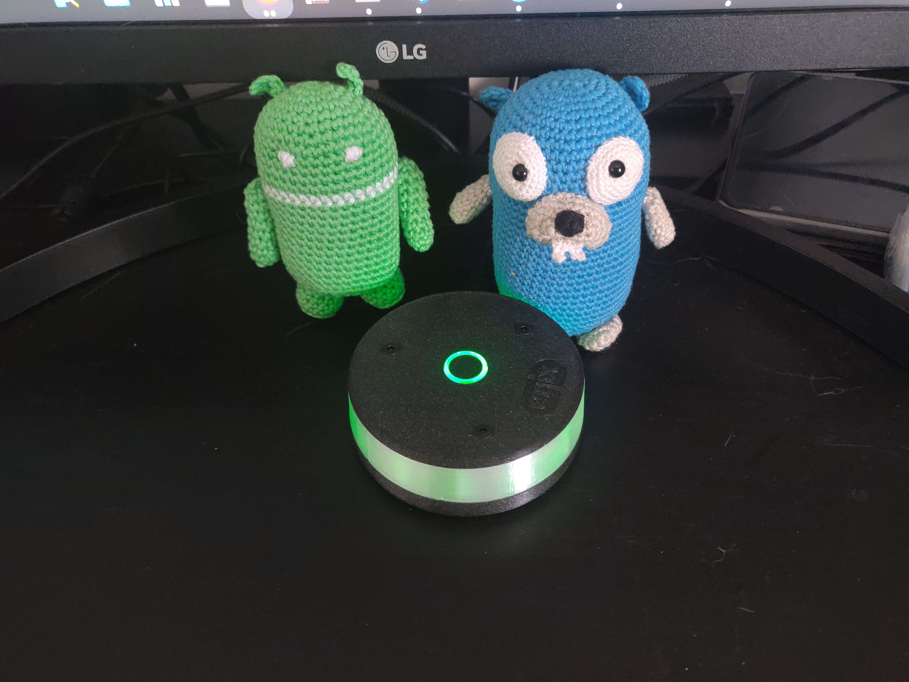
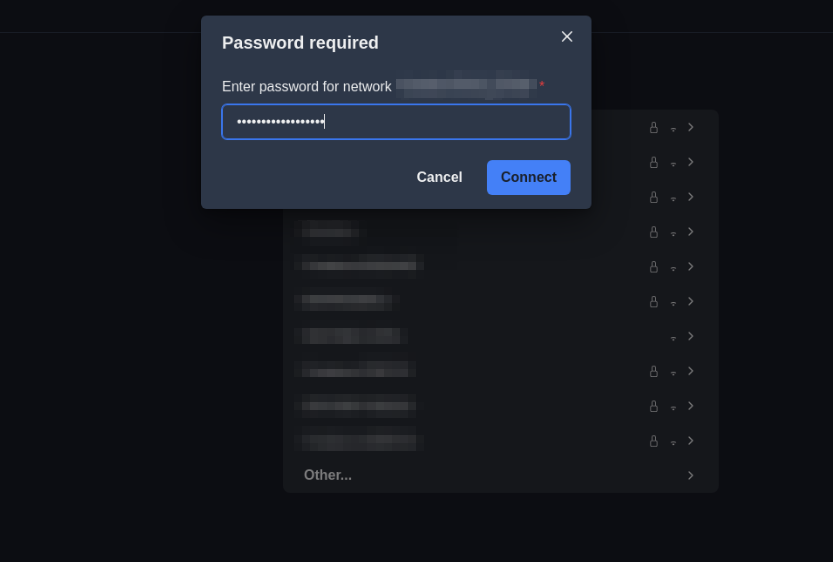
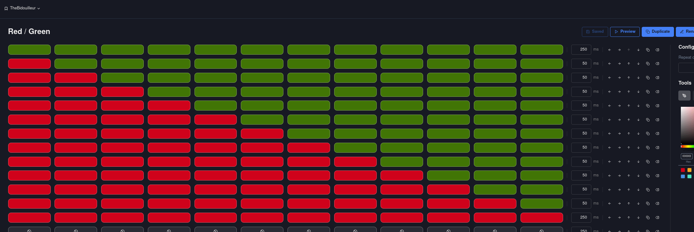
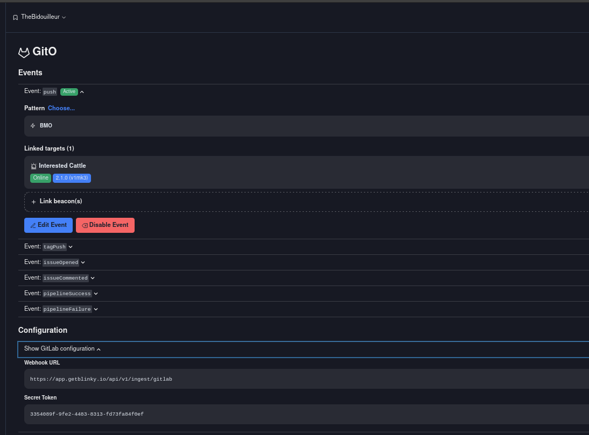

Grâce à [ZWindler et sa série de threads Twitter à propos du reverse d'un petit appareil connecté](https://blog.zwindler.fr/2023/06/16/reverse-blinky-enix-part1/), j'ai découvert le projet Blinky. Il s'agit d'un petit gyrophare connecté qui peut vous faciliter la vie durant vos astreintes.

:::note En Bêta !

Le projet Blinky est encore en cours de développement, il est donc possible que certaines choses changent d'ici la sortie de la version définitive.

:::

J'ai alors décidé de remplir le [formulaire pour être bêta-testeur](https://www.getblinky.io/) et j'ai reçu le mien 1-2 semaines plus tard.

Pendant le délai d'attente, j'ai commencé à regarder et à me renseigner *(via le thread de ZWindler et en posant des questions)* sur le fonctionnement de l'appareil et sur les possibilités qu'il offre.

J'ai eu le temps de m'amuser sur MicroPython *(Firmware pour lancer du Python sur ESP32)*, je prépare une page dessus pour vous montrer ce que j'ai fait, mais avant ça : on va parler du Blinky !

## Le Blinky

Le Blinky est pensé, produit et développé par [Enix](https://www.enix.io/fr), une société de services informatiques *(SSII)* qui propose des services d'infogérance, de conseil et d'expertise principalement autour du cloud et de Kubernetes. Ils proposent régulièrement des talks et des formations sur ces sujets.

De ce que j'ai compris, ils ont développé une armée de gyrophares connectés pour notifier d'éventuels problèmes/évènements sur les infrastructures de leurs clients.

L'idée me plaît beaucoup, et je trouve ça très malin de leur part et peut-être même un peu plus efficace que les traditionnels mails. *(Qui sont souvent noyés dans la masse)*

Une fois le Blinky reçu, j'ai pu le tester et le configurer. Je vais vous montrer comment faire.

## Configuration

La connexion au Blinky se fait via WebSerial, un peu comme l'IDE Arduino ou PlatformIO. Il faut donc utiliser un navigateur compatible, comme Chromium ou Edge. Il vous faudra vous rendre sur la page de configuration du Blinky et créer un compte : [app.getblinky.io](https://app.getblinky.io).

Dès la première connexion, le Blinky va vous demander de le configurer. Il faut alors se connecter à un réseau WiFi et renseigner les informations de connexion depuis la page de configuration du Blinky.

:::caution Fréquence WiFi

à noter que le Blinky ne supporte que les fréquences 2.4GHz *(cela est dû à la puce ESP32 qu'il embarque)* et ne supporte pas les fréquences 5GHz.

:::

Le Blinky va se connecter à votre Wifi et vous pourrez l'associer à une organisation. *(Si vous n'en avez pas, vous pouvez en créer une)*

à retenir que la LED du dessus affiche le statut de connexion au WiFi et que celle du dessous affiche les animations de notification.

*Au démarrage, voici ces différentes animations (attention aux épileptiques) pour vous informer si le Blinky se connecte bien à votre WiFi:*

À la fin de l'initialisation, la LED du dessus devrait être verte. L'équipe d'Enix a prévu une amélioration pour s'assurer que la LED du dessus ne puisse pas se voir depuis la partie blanche. Pour l'instant, j'envisage de démonter le Blinky et rajouter une impression 3D ou un peu de scotch noir pour éviter que la lumière ne se diffuse trop.

Et, une fois connecté, vous pouvez créer des animations depuis un éditeur en ligne et les prévisualiser sur votre navigateur *(J'aurais aimé pouvoir les prévisualiser directement sur le Blinky, mais ce n'est pas encore possible)*.

L'éditeur est très simple à utiliser et permet de créer des animations très rapidement, mais je ne peux pas m'empêcher de penser à un éditeur plus avancé qui permettrait de créer des animations à partir de code mais je peux comprendre que ce ne soit pas la priorité.

Pour l'instant, les couleurs visibles sur le site ne sont pas les mêmes que celles affichées sur le Blinky *(ex avec un Blinky Rouge qui est plutôt rose)*, mais cela devrait être corrigé dans une prochaine version.

## Intégration

Il est important de noter que le Blinky seul ne va pas se connecter à vos services pour récupérer des informations. C'est l'application externe *(app.getblinky.io)* qui va envoyer l'instruction au Blinky pour qu'il affiche une animation. *(Peut-être un jour une version auto-hébergeable pour les services sensibles ?)*

La principale intégration est celle du WebHook:

Une requète *(POST ou GET, ça revient au même)* est envoyée à l'URL du WebHook et l'animation liée est jouée sur le Blinky.

*Petite idée : Un webhook générique qui permettrait de choisir l'animation à jouer en fonction du JSON envoyé (même idée pour choisir le groupe de Blinky)*.

L'intégration Prometheus se fait à partir de AlertManager. Celle-ci s'appuie sur un Webhook et peut avoir des labels en tant que conditions. Cela permet de faire des notifications différentes en fonction de l'importance de l'alerte.

Je n'ai pas encore eu l'occasion de tester, mais ça sera fait prochainement.

Et, pour finir, l'intégration avec Gitlab *(qui supporte plusieurs animations en fonction de l'évènement)* :

*(Testé et approuvé !)*.

## Conclusion

Pleins d'améliorations sont prévus pour le Blinky, que ça soit les possibilités d'intégration ou le design de l'appareil. Je suis très content de l'avoir reçu et je suis impatient de voir ce que l'équipe d'Enix va nous proposer.

J'ai personnellement vraiment hâte de la sortie du SDK pour pouvoir le bidouiller un peu plus en profondeur et voir de nouvelles intégrations comme Zabbix, Home-assistant, Gotify ou même un petit serveur MQTT.
